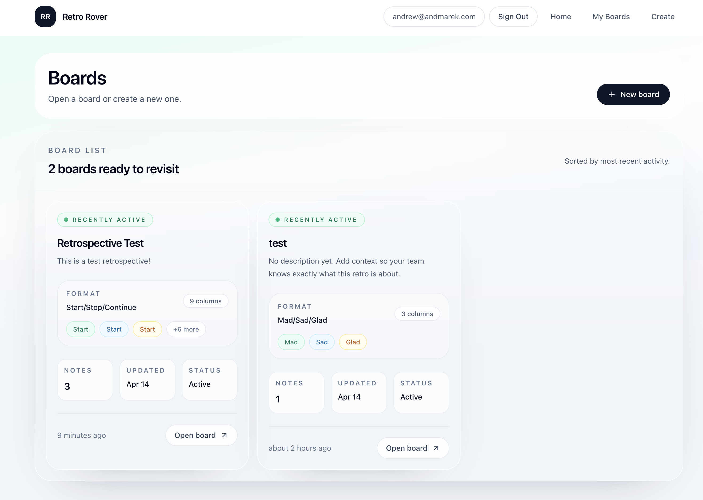
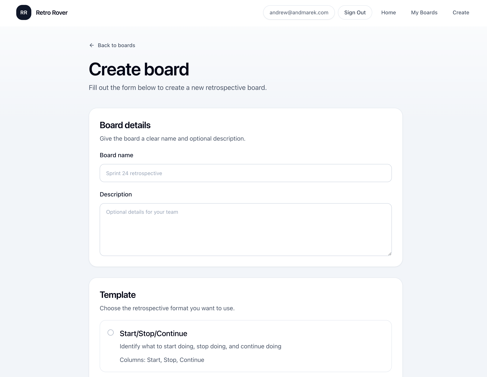
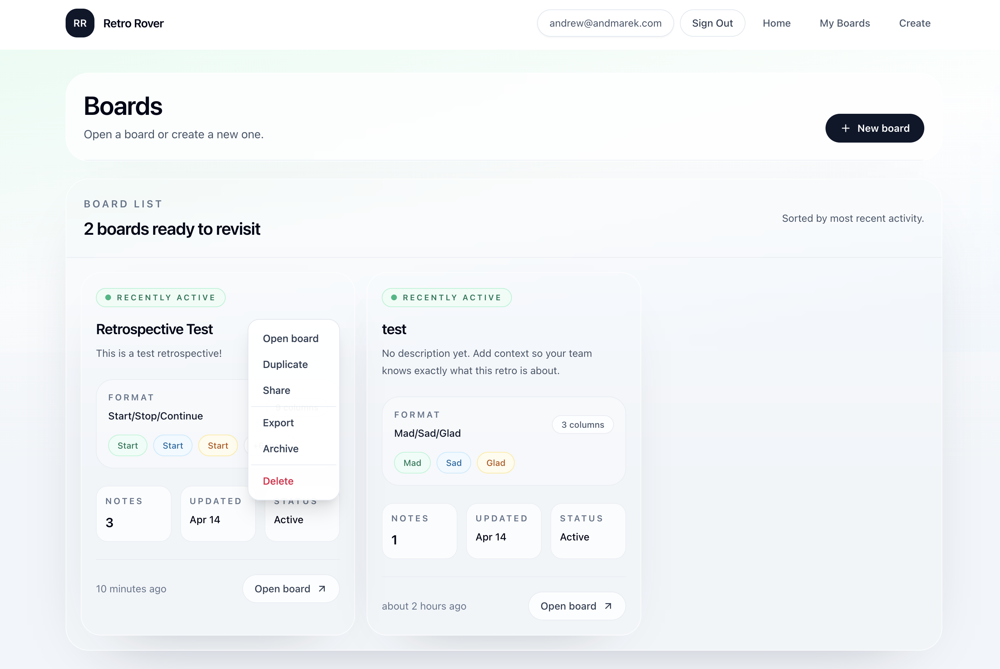
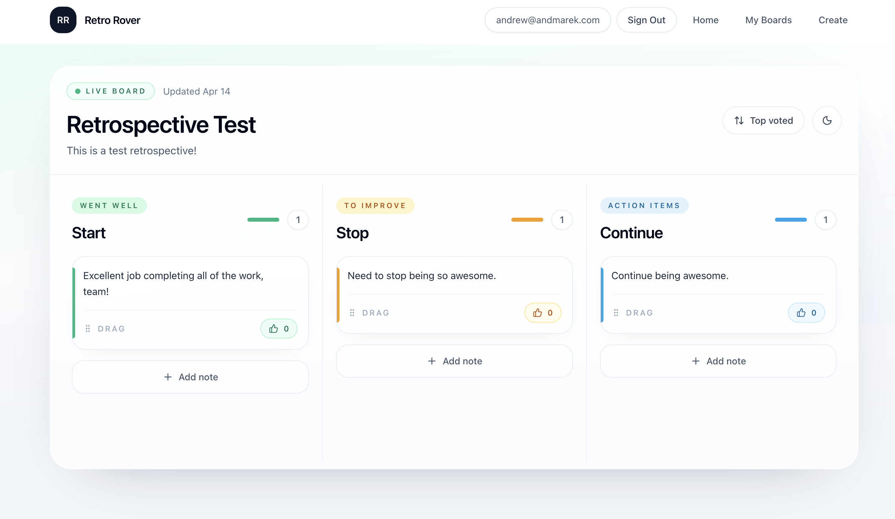

# RetroRover

RetroRover is an open-source retrospective board application built for teams that want a simple, self-hosted alternative to tools like EasyRetro.

I originally built it after running bi-weekly retrospectives for my team and getting frustrated with limits in existing tools. I wanted something lightweight, flexible, and fully under my own control, so I started building my own version.

## Features

- Create and manage retrospective boards
- Organize feedback into columns
- Drag-and-drop card interactions
- Real-time collaborative updates via websockets

## Tech Stack

- Next.js
- TypeScript
- Socket.IO
- PostgreSQL

## Project Status

> [!WARNING]
> This project is **not currently under active development**.
> It was a meaningful project for me as a backend engineer looking to get deeper experience with frontend product development, UI design, and interactive application flows.

Most of the work was done in 2023 (pre-LLM assisted coding) as a hands-on side project focused on building the product myself end to end. It has since been revamped using agents.

## Screenshots

Recent UI snapshots from the current product refresh:

| Boards overview | Create board form |
| --- | --- |
|  |  |
| Board actions menu | Live board view |
|  |  |
